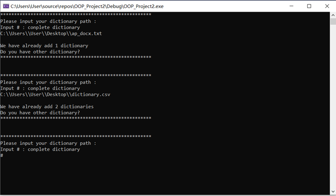
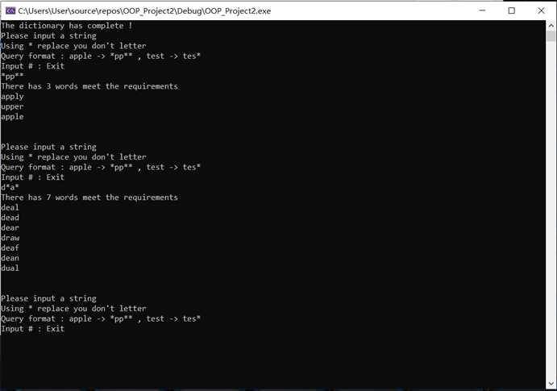

# **Word-Processing-programs**

-----

>  Team: [@Hongbo Wang ](https://github.com/BOBWang1117)
>
>  

## **Environment:**

- Microsoft Visual Studio

  

## **Details**

- Type: term project

- Teacher: 梁宝

- Computer Language: C++

- Project Name: Word-Processing-programs

- Time: 2020/05/12

- Description: First, process several *.txt files, process the words in the files, sort (frequency of use), and output a .csv file. Then according to the .csv file (words, number of uses) the words that need to be completed in the puzzle are suggested.

  

## **Dependencies:** 

- None

## **Install package:**

- None

## **Run program:**

- Open Visual Studio
- Create a new project
- put *.h file into header folder
- put *.cpp file into recourse folder
- rember your *.txt path

 

## **Example:**

1. 

   

2. 

   

